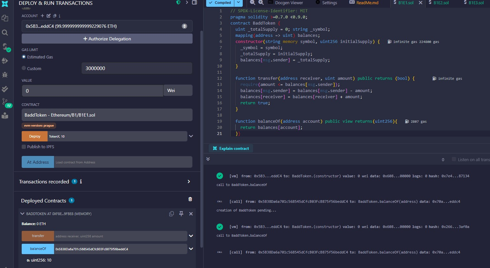

# Ethereum Smart Contract Exercise
This repository contains the solutions to Problem B1 **Exercise 1-6**.
Screenshots of the implementation process and execution results are provided for clarity.

## Table of Contents
1. [Exercise 1 - ERC20 Token Transfer](#exercise-1-erc20-token-transfer)
2. [Exercise 2 - Extended Token Contract](#exercise-2-extended-token-contract)

---

## Exercise 1 - ERC20 Token Transfer
This was fairly easy exercise. First, I had to familarize with remix; however, I had previously completed A2 Exercise so, this was not a problem.
I would say learning about ethereum from the official docs was very helpful as it taught me on how it works. Basically, all the information about the
blockchain, MPT(data storage), gloal state Trie, Transcation Trie, Receipt Trie, Storage Trie, how Contract Account and EOA accounts are made and how do they go to the blockchain, EVM.
Also, Uniswap official docs with other resources helped me to learn how this Decentralized exchange allows to swap ERC-20 tokens.
I did some experiments with Uniswap V1 and V2, basical, understanding how it works from very fundamental level.
V1 is simple and easy to understand but V2 with introduction of smart contracts like Factory, Router, Pair helped me alot to do these exercises.

**Process and Screenshots**

1. Deploy "BaddToken in Remix.
    0x5B38Da6a701c568545dCfcB03FcB875f56beddC4 = me
    0xAb8483F64d9C6d1EcF9b849Ae677dD3315835cb2 = Alice

   
2. Transfer tokens between accounts.
    The mine amount is 0 now.
   
3. Check balance after transfer.
    The balance of Alice account is 10 now after transfer.
  

## Exercise 2 - Extended Token Contract

Given that I went to look source code of uniswap V2 and have knowledge on how each token  are under ERC-20 compliant I started gathering more information.
The instruction were given clearly and with understanding of the concept of all the functions of ERC-20 token as well as solidity docs, writing the function was
not difficult.

**Process and Screenshots**
Alice Account = 0x5B38Da6a701c568545dCfcB03FcB875f56beddC4
Bob Account = 0xAb8483F64d9C6d1EcF9b849Ae677dD3315835cb2
Charlie Account = 0x4B20993Bc481177ec7E8f571ceCaE8A9e22C02db

1. Deploy BaddToken with balance of Alice = 1
    
2. A.approve(C,1)
    The allowance of C is 1 now.
    
3. C.transferFrom(A,B,1)
    The balance of B is 1 and allowance is 0
    

